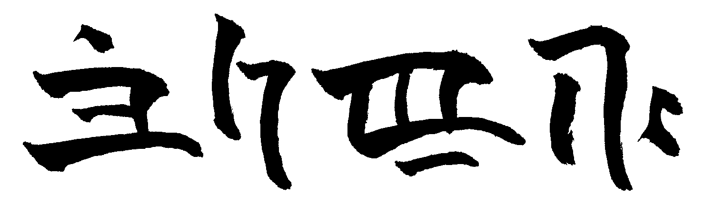
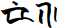

bachirulo brush
===============

a brush-and-ink calligraphy font for galu (), a conlang
i'm currently designing

galu's sounds are composed of [morae][1], and written using a [syllabary][2]
with [diacritics][3], but for convenience sake this font uses ligatures to map
these glyphs directly to the languages' romanisation, like so:

check back later for more information ^_^

[1]: https://en.wikipedia.org/wiki/Mora_(linguistics)
[2]: https://en.wikipedia.org/wiki/Syllabary
[3]: https://en.wikipedia.org/wiki/Diacritic
